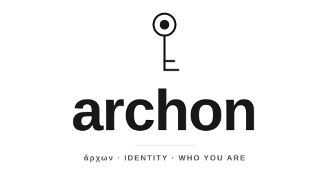

<!-- design:figure id=archon-wordmark -->
<p align="center">
  <picture>
    <source media="(prefers-color-scheme: dark)" srcset="./docs/img/archon-wordmark-dark.svg">
    
  </picture>
</p>
<!-- /design:figure -->

<p align="center"><em>ἄρχων — the officeholder; the one who bears the office.</em></p>
<p align="center"><em>Who you provably are — as bytes anyone can re-check.</em></p>

[](https://github.com/Bitspark/archon/actions/workflows/conformance.yml)
[](https://pkg.go.dev/github.com/Bitspark/archon/core/go)
[](LICENSE)

---

Ed25519 identity with **one** spelling. A key is `ed25519:<64 hex>` — the same 32 bytes, the
same text, in each of the eight languages archon ships ([languages](docs/languages.md)),
checked against one oracle on every push. The PEM
codecs are RFC 5280 SPKI and RFC 5958 PKCS-8, nothing invented. Signing is
domain-separated, so a signature made for one context cannot count in another.

It answers exactly two questions — *are these bytes that key?* and *is this signature that
key's?* — and deliberately answers nothing else. What a key is allowed to do, and where a
key is kept, are somebody else's questions. See [Scope](#scope).

<!-- quickstart: cli/smoke.mjs runs this block as written, in all three CLI lanes, on every push (cli/quickstart.mjs) -->
```console
$ archon keygen --out key.pem --pub-out key.txt --pub-format text
ed25519:d75a980182b10ab7d54bfed3c964073a0ee172f3daa62325af021a68f707511a
$ printf 'hello' > message.txt
$ archon sign --key-file key.pem --domain example.v1 --in message.txt > sig.hex

$ archon verify --pubkey "$(cat key.txt)" --sig "$(cat sig.hex)" --domain example.v1 --in message.txt
valid
$ archon verify --pubkey "$(cat key.txt)" --sig "$(cat sig.hex)" --domain example.v2 --in message.txt
invalid
```

`keygen` prints the public key text and writes two files: `key.pem`, the private key as a
PKCS#8 PEM, and `key.txt`, the public key text. `sign` reads the PEM with `--key-file`, so
the private key never appears on a command line. The last line is the point of signing in
a domain: the same signature is `invalid` in any other domain.

`verify` prints `valid` or `invalid` and exits 0 or 1 — a verdict on stdout, not a usage
error, so a failed check is scriptable. The block above is executed exactly as written by
[`cli/smoke.mjs`](cli/smoke.mjs) in all three command implementations on every push;
`node cli/quickstart.mjs -- archon` runs it against the `archon` you have installed.

The same three operations, as a library:

```go
import (
    "github.com/Bitspark/archon/core/go/crypto"
    "github.com/Bitspark/archon/core/go/keytext"
)

pub  := crypto.PublicKeyFromSeed(seed)         // 32 bytes -> 32 bytes
text := keytext.EncodeKey(pub)                 // -> "ed25519:d75a98…"
sig  := crypto.SignInDomain("example.v1", seed, msg)
```

```rust
let public = archon_core::public_key_from_seed(&seed);
let text   = archon_core::encode_key(&public);
let sig    = archon_core::sign_in_domain("example.v1", &seed, msg);
```

```ts
import { getPublicKey, encodeKey, signInDomain } from "@bitspark/archon";

const pub  = getPublicKey(seed);
const text = encodeKey(pub);
const sig  = signInDomain("example.v1", seed, msg);
```

## Three cores, one meaning

Rust, Go and TypeScript are not three ports that drifted. They are held to one hand-authored
oracle in [`vectors/`](vectors/), and the harness **recomputes** every case rather than
trusting the recorded answer:

```console
$ node conformance/check.mjs
all cores agree: 180 case-checks, 3 core(s)
```

That runs on every push. If the cores ever disagree about whether something is a valid key,
a valid signature or a valid key text, that disagreement *is* the bug — a consumer's two
ends may not be written in the same language.

`vectors/` is a published oracle: an independent implementation can check itself against it
without using any of this code.

## The tiers

| | what it adds |
|---|---|
| **core** | key bytes, the canonical key text, SPKI/PKCS-8, domain-separated sign and verify |
| **sdk** | signed envelopes, proof of possession, and the login scheme's audience binding |
| **cli** | the `archon` command — `keygen`, `key`, `sign`, `verify`, `login`, `version` |
| **server** | the login endpoint: proof-of-possession sign-in and key-to-key delegation |

## Install

```console
# Go — resolves straight from this repository
go get github.com/Bitspark/archon/core/go        # also /sdk/go, /cli/go, /server/go

# Rust — the package name carries the vendor prefix; what you `use` does not
cargo add bitspark-archon-core                   # use archon_core::…
                                                 # also -sdk, -cli, -server

# TypeScript
npm install @bitspark/archon                     # also -sdk, -cli, -server

# Python — import archon_core, archon_sdk
pip install bitspark-archon-core                 # also bitspark-archon-sdk

# Java — Maven Central; also artifactId archon-sdk
#   <dependency><groupId>dev.bitspark</groupId><artifactId>archon-core</artifactId>
#     <version>0.9.0</version></dependency>
```

The Go modules resolve directly from this repository and need nothing else; the others are
on their public registries. Python and Java publish the floor and an sdk (possession and
envelope, not the login scheme) as `bitspark-archon-sdk` and `dev.bitspark:archon-sdk`,
first released in 0.8.1. Which language carries which
tier, and how each claim is proven, is in [docs/languages.md](docs/languages.md).

The command is the same in all three languages — install it from whichever you already have:

```console
go install github.com/Bitspark/archon/cli/go/cmd/archon@latest
npm install -g @bitspark/archon-cli
cargo install bitspark-archon-cli                # installs the binary `archon`
```

On crates.io the packages carry a `bitspark-` prefix, because crates.io has a single flat
namespace with no scopes and the short `archon-*` names are not all available. It is a
registry name only: the library target keeps its own name, so you write
`use archon_core::…`, and the installed binary is `archon`.

The core's runtime dependencies, in full: `ed25519-dalek` (Rust) · the standard library's
`crypto/ed25519` plus `filippo.io/edwards25519` for point validation only (Go — the
published form of the implementation the standard library is maintained from; see ADR 0008
§5 for why a blocklist was not enough) · `@noble/curves` and `@noble/hashes` (TypeScript,
because noble v3 unbundles SHA-512 and makes you supply it) · PyCryptodome (Python, the one
mainstream route to Ed25519ph with a context) · Bouncy Castle, `bcprov-jdk18on` (Java) ·
OpenSSL ≥ 3.2 to sign and libsodium ≥ 1.0.21 to decide what is accepted (C++, Swift and
Haskell — [why two](docs/languages.md)). Nothing else, in any language, at any version. The
tiers above add only what their job needs, and each tier's manifest is the full list:
- the sdk, a hash and JSON for its transcripts;
- the server, JSON and an entropy source (its Go and TypeScript lanes use only their standard
  libraries);
- the command, its HTTP client, Argon2id and XChaCha20-Poly1305 for the key store, Unicode
  normalisation and a terminal prompt.

Each core binds its language's Ed25519 and archon writes only the encodings and
the checks on top; the curve arithmetic is not reimplemented here. What every core
*accepts* is written down once, in [ADR 0008](docs/architecture/decisions/0008-the-ed25519-verification-profile.md),
and checked ahead of the library rather than inherited from it.

## Scope

archon owns a security contract only where it can state the **whole** of it, with no
authorization or transport vocabulary
([ADR 0011](docs/architecture/decisions/0011-transport-integrations-stay-above-archon.md)).

- **The core** is RFC 8032, RFC 5280 and RFC 5958 vocabulary alone: a seed, a public key, a
  signature, an opaque message, a key text, a PEM.
- **Above it**, archon owns only named protocols whose whole claim it can state: the login
  scheme, the signing boundary, and the request and enrollment profiles.

It deliberately does **not** own:

- **Authority.** Whether a key may do a thing is not archon's question. The login server
  hands the authority payload to the consumer through `AdmitAuthority` and never reads it.
- **Custody, past one store.** The libraries hold no key: `core` and `sdk` take the seed
  bytes they are given and never learn a file path, a password or a directory. The command
  has exactly one custody feature, accepted in
  [ADR 0007](docs/architecture/decisions/0007-custody-in-the-command-and-the-login-server-tier.md):
  `archon key` keeps seeds under names in a password-protected store (Argon2id and
  XChaCha20-Poly1305, one file per key — [the format](docs/keystore.md)), and `archon login`
  signs with a stored key or the default one. It is for people; agents and CI use seed
  files. Rotation, root ceremonies, retiring an epoch, recovery, hardware tokens and agents
  are not archon's — rotation is the authority's (issue to the new key, let the old grants
  expire).
- **Succession.** There is no re-key path. A key dies with itself; loss or compromise means
  generating a new one.
- **Transports.** archon authenticates a request; it does not host one. A Git credential
  helper, the credentials a service issues, an SSH-key association and a Git command gate
  belong to the product that hosts Git. archon's request profile authenticates the exchange
  that issues such credentials (ADR 0011).

[ADR 0001](docs/architecture/decisions/0001-archon-scope.md) works an example in which archon
argued to take something and was — correctly — refused: a Merkle-inclusion format that
[thesmos](https://github.com/Bitspark/thesmos) defines for its own verification. archon had measured that thesmos's code depends on
the format, and took that to mean archon should own it. In the ADR's words, *"a dependency
graph says what a module touches; it does not say what a module is."*

## Documentation

- [Architecture decisions](docs/architecture/decisions/) — why the boundaries are where they are
- [The login scheme](docs/login.md) — proof of possession, audience binding, delegation
- [Adopting archon](docs/adoption.md) — which tier does which job, the two signature schemes, and what is not available
- [Login, end to end](examples/login/) — a service, a key-less client and a person, on the published packages, run in CI
- [The key store](docs/keystore.md) — what `archon key` does and does not do
- [Conformance](conformance/) and [the oracle](vectors/) — how agreement is established
- [CONTRIBUTING.md](CONTRIBUTING.md) · [SECURITY.md](SECURITY.md) · [CODE_OF_CONDUCT.md](CODE_OF_CONDUCT.md)

## License

Apache-2.0. See [LICENSE](LICENSE) and [NOTICE](NOTICE).

<p align="center"><sub><em>Prove who you are. The law decides the rest.</em></sub></p>
